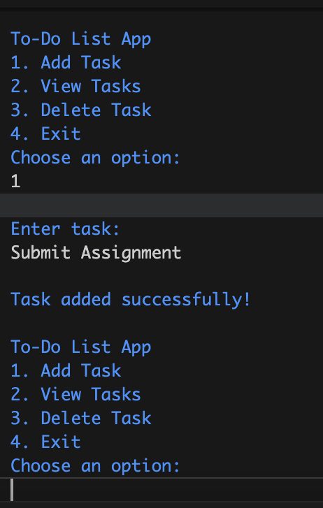

# To-Do List App

A simple and efficient Java-based To-Do List application that helps users manage their daily tasks.

## Features

- Add new tasks
- View all tasks in a structured format
- Delete tasks when completed
- Persistent storage using file handling

## Why I Built This Project

This project was created to:
- Strengthen my Java programming skills and learn file handling.
- Apply CRUD operations (Create, Read, Delete) in a real-world scenario.
- Gain hands-on experience with Git and GitHub for version control.
- Build a practical project that improves productivity and task management.

## Technologies Used

- Java (Core Logic)
- File Handling (Data Persistence)
- Git & GitHub (Version Control)

## Lessons Learned

- Handling user input efficiently
- Implementing file operations for saving and retrieving data
- Understanding project structure and modular programming
- Using Git and GitHub to manage and track changes

## How to Run the Project

1. Clone the repository:
   ```sh
   git clone git@github.com:arshiamohdd/ToDoListApp.git
    ```
2. Navigate to the project folder:
    ```sh
cd To-do-App
    ```
3. Compile and run the Java file:
    ```sh
javac ToDoListApp.java 
java ToDoListApp
     ```
## Project Demo


## How to Contribute

If you would like to contribute:
- Fork the repository
- Create a new branch for your feature
- Submit a pull request with your improvements

## License

This project is licensed under the MIT License.

Copyright (c) 2025 Arshia Mohammed


